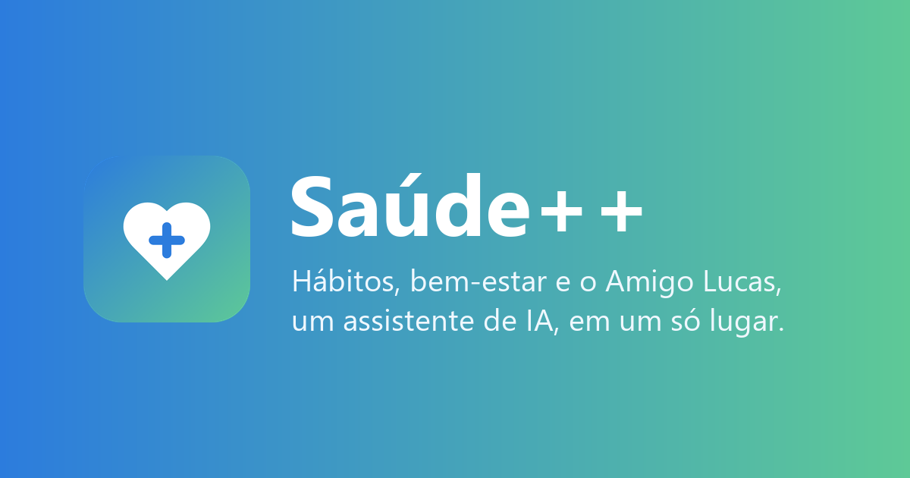
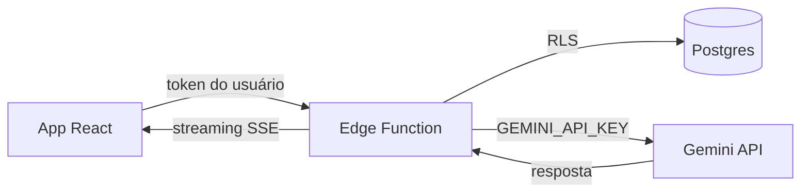
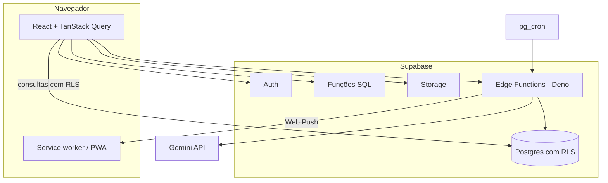

<p align="center">
  
</p>

# Saúde++

O Saúde++ é um app web de bem-estar que reúne num só lugar o que normalmente fica espalhado em vários aplicativos: hábitos do dia, humor e energia, treinos, sons para foco e relaxamento, o progresso ao longo das semanas e uma conversa com o **Amigo Lucas**, um assistente de IA que conhece o seu contexto.

É um projeto pessoal, open source, que uso para estudar e mostrar como construo um produto de ponta a ponta: interface, banco de dados, segurança, integração com IA e deploy.

> **Importante:** o Saúde++ é um projeto de estudo e portfólio. Ele não faz diagnóstico, não prescreve tratamento e não substitui médicos, psicólogos ou outros profissionais de saúde. Se você estiver passando por um momento difícil, ligue para o **CVV, 188** (gratuito, 24 horas) ou acesse [cvv.org.br](https://cvv.org.br).

## Por que eu fiz

Cuidar da saúde no dia a dia costuma virar uma coleção de apps: um para hábitos, outro para treino, outro para meditar, e nenhum conversa com o outro. Eu queria ver como seria juntar isso numa experiência só, e usar IA onde ela faz diferença de verdade: montar hábitos e treinos a partir do perfil de cada pessoa e conversar sobre como ela está, levando em conta o que ela já contou.

## O que o app faz

- **Hábitos do dia.** A IA cria uma lista de hábitos simples a partir do seu perfil, e todo dia o app escolhe seis, variando as categorias (movimento, alimentação, sono, respiração, social, foco, emoção). A escolha favorece o que não aparece há algum tempo e o que você costuma deixar passar.
- **Check-in.** Como você está se sentindo e com quanta energia, em dois toques.
- **Amigo Lucas.** Um chat com respostas em tempo real, que você ajusta: mais direto ou mais detalhado, mais acolhedor ou mais racional.
- **Treinos.** Plano semanal gerado pela IA conforme objetivo, local, nível e limitações; registro de cargas com gráfico de evolução; medidas corporais; estimativa de percentual de gordura pelo método da Marinha dos EUA.
- **Sons.** Chuva, mar, floresta, ruído branco e outros, com mixagem de volume e temporizador.
- **Progresso.** Gráficos de humor e hábitos, sequência de dias completos e restauração de sequência (três por mês).
- **Social.** Amigos por nickname, perfil com controle de privacidade e desafios entre amigos com confirmação dos dois lados.
- **Lembrete diário.** Notificação no horário que você escolher, mesmo com o app fechado (Web Push).
- **Do seu jeito.** Tema claro, escuro ou automático, e instalação como app no celular (PWA).

## Como a IA funciona

Toda chamada de IA passa pelo backend. A chave da Gemini fica só nos secrets do Supabase e nunca chega ao navegador.



- **Amigo Lucas** (`chat-lucas`): o app envia só a mensagem nova. A função busca o histórico recente da conversa no banco, junta o perfil e as preferências da pessoa num prompt de sistema e transmite a resposta em streaming. As duas mensagens são salvas no servidor, então o cliente não consegue reescrever o que o Lucas disse nem injetar instruções no histórico.
- **Hábitos** (`gerar-habitos`) e **treinos** (`gerar-treino`): a Gemini responde em JSON guiado por um schema. A função valida cada item e troca a lista antiga pela nova numa única transação no banco. Hábitos antigos são desativados, não apagados, para o histórico continuar intacto.
- **Quando algo dá errado**, nada quebra: há timeout, uma nova tentativa em falhas temporárias e mensagens claras para limite de uso, indisponibilidade ou resposta fora do formato. Se a IA estiver fora do ar no primeiro acesso, o app usa uma lista inicial de hábitos. Se o filtro de segurança bloquear uma resposta do Lucas, ele responde com acolhimento e indica o CVV.
- **Cota por usuário** no banco, para uma pessoa só não esgotar o limite gratuito da API.
- O **modelo** é configurável pela variável `GEMINI_MODEL`. O padrão é `gemini-3.5-flash-lite`, estável e disponível no nível gratuito.

## Arquitetura



Algumas decisões que guiaram o projeto:

- **As regras ficam no banco.** O que não pode ser burlado (privacidade de perfis, amizade, progresso de desafios, seleção diária de hábitos) é garantido por RLS e funções SQL, não pela interface.
- **Uma fonte de verdade por dado.** A lista de hábitos do dia é gravada na primeira abertura, e Início, Hábitos e Progresso leem exatamente a mesma informação.
- **Telas carregadas sob demanda.** Gráficos e o chat só são baixados quando você chega neles. Se um deploy novo remover arquivos antigos, o app percebe e recarrega sozinho.

## Stack

| Camada | Tecnologias |
| --- | --- |
| Interface | React 18, TypeScript (strict), Vite, Tailwind CSS, Radix UI, Framer Motion, Recharts |
| Dados no cliente | TanStack Query, supabase-js |
| Backend | Supabase: Postgres, Auth, Storage, Edge Functions (Deno), pg_cron |
| IA | Google Gemini API (REST) |
| Testes | Vitest, Testing Library, PGlite (Postgres em memória para testar as migrations) |
| Hospedagem | Hostinger (site estático) e Supabase (backend) |

## Segurança e privacidade

- **Row Level Security** em todas as tabelas. Cada pessoa só acessa os próprios dados, e as tabelas-filhas conferem o dono do registro pai.
- **Perfis de terceiros** só por funções que aplicam a privacidade no servidor. Dados de saúde aparecem apenas para amigos, e apenas o que a pessoa liberar.
- **Nenhum segredo no frontend.** O navegador só recebe a URL e a chave pública do Supabase; chave da IA, chave administrativa e segredo do cron ficam nos secrets.
- **CORS restrito** às origens configuradas, **CSP** e cabeçalhos de segurança no `.htaccess`.
- **Service worker** guarda só os arquivos do próprio app, nunca respostas da API.
- **Exclusão de conta** em um clique, apagando tudo em cascata (direito previsto na LGPD).
- O nível gratuito da Gemini permite que o Google use o conteúdo enviado para melhorar seus produtos. Isso está explicado na [Política de Privacidade](src/pages/PoliticaPrivacidade.tsx) do app.

## Rodando localmente

Você vai precisar de Node.js 20.19 ou mais recente, de um projeto no [Supabase](https://supabase.com) (o plano gratuito basta) e de uma chave da [Gemini API](https://aistudio.google.com/apikey).

```bash
git clone https://github.com/lbarbosac/saude-mais-mais.git
cd saude-mais-mais
npm install
cp .env.example .env   # no PowerShell: Copy-Item .env.example .env
```

Preencha o `.env` (próxima seção), prepare o Supabase e rode:

```bash
npm run dev
```

O app abre em `http://localhost:8080`.

### Variáveis de ambiente

No `.env` (vão para o navegador, então só valores públicos):

| Variável | Obrigatória | Descrição |
| --- | --- | --- |
| `VITE_SUPABASE_URL` | sim | URL do projeto (Project Settings > API) |
| `VITE_SUPABASE_PUBLISHABLE_KEY` | sim | Chave publishable (`sb_publishable_...`) ou a anon, em projetos antigos |
| `VITE_VAPID_PUBLIC_KEY` | não | Chave pública VAPID, para os lembretes |
| `VITE_CONTATO_EMAIL` | não | E-mail exibido nos termos e na política de privacidade |

Nos secrets das Edge Functions (`npx supabase secrets set NOME=valor`):

| Secret | Obrigatório | Descrição |
| --- | --- | --- |
| `GEMINI_API_KEY` | sim | Chave da Gemini API |
| `GEMINI_MODEL` | não | Modelo da Gemini (padrão `gemini-3.5-flash-lite`) |
| `ALLOWED_ORIGINS` | em produção | Origens permitidas, separadas por vírgula (ex.: `https://seu-dominio.com.br`) |
| `VAPID_PUBLIC_KEY`, `VAPID_PRIVATE_KEY`, `VAPID_SUBJECT` | não | Para os lembretes por Web Push |
| `CRON_SECRET` | não | Segredo que o pg_cron envia para disparar os lembretes |

O modelo de cada arquivo está em [`.env.example`](.env.example) e [`supabase/functions/.env.example`](supabase/functions/.env.example).

### Supabase: banco, funções e storage

```bash
npx supabase login
npx supabase link --project-ref SEU_PROJECT_REF
npx supabase db push            # aplica as migrations de supabase/migrations
npx supabase functions deploy   # publica as Edge Functions
npx supabase secrets set GEMINI_API_KEY=sua-chave ALLOWED_ORIGINS=http://localhost:8080
```

As migrations criam as tabelas, as políticas de RLS, as funções e os buckets de Storage. Depois disso, falta pouco:

- **Auth:** em Authentication > URL Configuration, defina a *Site URL* e inclua em *Redirect URLs* o endereço do app (`http://localhost:8080/**` e o domínio de produção). É para onde vão os links de confirmação de e-mail e de troca de senha.
- **Sons:** os arquivos de áudio não fazem parte do repositório. Envie arquivos MP3 para o bucket `sounds` com os nomes `chuva.mp3`, `mar.mp3`, `rio.mp3`, `floresta.mp3`, `vento.mp3`, `fogueira.mp3`, `campo.mp3`, `cidade.mp3`, `ruido-branco.mp3` e `meditacao.mp3`. Sons que faltarem aparecem como indisponíveis.

### Configurando a Gemini

1. Crie uma chave em [aistudio.google.com/apikey](https://aistudio.google.com/apikey).
2. Salve como secret: `npx supabase secrets set GEMINI_API_KEY=sua-chave`.
3. Opcional: troque o modelo com `npx supabase secrets set GEMINI_MODEL=nome-do-modelo`, sem mudar código. Os limites do seu nível de uso aparecem no próprio AI Studio.

### Lembretes diários (opcional)

1. Gere as chaves com `npx web-push generate-vapid-keys`. A pública vai no `.env` (`VITE_VAPID_PUBLIC_KEY`) e nos secrets, a privada só nos secrets. `VAPID_SUBJECT` é um `mailto:` seu.
2. Defina um `CRON_SECRET` longo e aleatório nos secrets.
3. Ative as extensões `pg_cron` e `pg_net` (Database > Extensions) e agende a função no SQL Editor:

```sql
select vault.create_secret('o-mesmo-CRON_SECRET', 'cron_secret');

select cron.schedule('saude-lembretes', '0 * * * *', $$
  select net.http_post(
    url := 'https://SEU_PROJECT_REF.supabase.co/functions/v1/enviar-lembretes-diarios',
    headers := jsonb_build_object(
      'Content-Type', 'application/json',
      'x-cron-secret', (select decrypted_secret from vault.decrypted_secrets where name = 'cron_secret')
    )
  );
$$);
```

Os lembretes só funcionam no build de produção, servido por HTTPS.

## Deploy na Hostinger

O frontend é um site estático.

```bash
npm run build
```

1. Envie **todo o conteúdo** da pasta `dist/` para a `public_html` do domínio, pelo Gerenciador de Arquivos ou por FTP. Inclua o `.htaccess`, que é um arquivo oculto.
2. Ative o SSL e a opção de forçar HTTPS no hPanel.
3. No Supabase, adicione o domínio em `ALLOWED_ORIGINS` e nas URLs de Auth.

O `.htaccess` faz as rotas do app funcionarem ao acessar um endereço direto ou atualizar a página, devolve 404 para arquivos de build que não existem mais e define cabeçalhos de segurança e cache. As variáveis `VITE_*` entram no build, então rode `npm run build` com o `.env` de produção.

## Estrutura do projeto

```text
src/
  pages/                telas (uma por rota)
  components/
    features/           chat, hábitos, onboarding, conquistas, PWA
    layout/             navegação (barra inferior no celular, menu lateral no desktop)
    ui/                 componentes base (Radix + Tailwind)
  hooks/                hábitos do dia, onboarding, push, presença
  lib/
    supabase/           cliente, chamada às funções e tipos gerados do banco
    utils/              datas locais e seleção de hábitos
  test/                 testes do frontend
supabase/
  migrations/           schema, RLS e funções SQL, em ordem
  functions/            Edge Functions (Deno) e módulos compartilhados
  tests/                testes do banco com PGlite
public/                 ícones, manifest, service worker e .htaccess
```

## Qualidade

```bash
npm run check   # typecheck, lint, testes e build
```

Os testes cobrem validações, datas, seleção de hábitos e leitura de streaming no frontend. No banco, as migrations são aplicadas num Postgres em memória e cada regra é testada agindo como usuários diferentes: privacidade de perfis, amizades, desafios, seleção diária de hábitos, sequência, Storage, cota da IA e exclusão de conta.

## Limitações conhecidas

- A IA roda no nível gratuito da Gemini, com limites de requisições por minuto e por dia. Com muitos usuários, seria preciso um plano pago.
- Respostas de IA podem errar. O app deixa isso claro, mas não há revisão humana do conteúdo.
- O app precisa de internet para quase tudo: o modo offline guarda a interface, não os dados.
- Os lembretes dependem de suporte a Web Push. No iPhone, só funcionam com o app instalado na tela inicial (iOS 16.4 ou mais recente).
- A interface existe só em português.

## Histórico

O Saúde++ começou como protótipo no Lovable. Depois o projeto passou a ser mantido de forma independente: backend próprio no Supabase, IA trocada para a Gemini, regras de segurança refeitas no banco e boa parte do frontend reescrita.

## Contribuindo

Sugestões e correções são bem-vindas. Abra uma issue descrevendo o problema ou a ideia. Para pull requests, rode `npm run check` antes de enviar e use mensagens de commit no formato `tipo(escopo): descrição`.

## Licença

[MIT](LICENSE) © Lucas Barbosa
